# Introduction

Welcome to one of my favorite projects, this is a Java-based remote server management tool with a Discord interface or what I personally like to call her... Nyx!

# Motivation

### Problem
One of my frustrations with my server is that it can break while I am outside, consequently breaking the home internet and as a result my family gets pissed off.  
The goal here was the ability to try to solve the issue on my phone while I am outside without having to SSH in and figure out what is wrong, and if possible, I could go a step further and have my own command center...

### Solution

Now the goal here was some quick and easy fixes, like restarting Docker containers or similar, but also some debugging tools for deeper inspection if needed, like executing commands (`lsblk`, `uptime`, `disk-free`, `ping` etc...).

Now I needed an interface. I could have used a frontend, but I realized it would have taken a long time and distracted away from the main objective, so I decided to use something that already exists, has the tools to be able to send certain messages where user error is minimal (more on that later), and a good user-friendly UI, and that's where **Discord** comes in. So I decided to use that as my interface; it has slash commands, which is awesome for command execution, and it has embeds, which is awesome for a dashboard-looking message (also more on that later).

Since my main language is Java, my library for the Discord API is JDA.

In short, my Tech Stack is:
- **Backend**: Java/Spring Boot (JDA)
- **Frontend**: Discord

# Under the Hood (The Cool Stuff)

This application consists of 3 big features: the Commands, the Dashboard, and the Features.

## Commands
### Structure

Commands consist of 3 things: the **command** itself, the **flags**, and the **arguments**, all of which are beautifully designed and easily configured in `commands.json`.

```json
{  
  "name": "disk-usage", 
  "description": "Check the remaining storage space on the server", 
  "command": "df",  
  "is_image": true,  
  "fixed_flags" : "-h --total",
  "flags": [  
	    {    
			"name": "drive_type",  
			"description": "Filter by a specific file system type",  
			"flag": "-t",  
			"type": "STRING",  
			"choices": {
		        "Main NVMe (ext4)": "ext4",
		        "Storage Pool (zfs)": "zfs",
		        "RAM Disks (tmpfs)": "tmpfs"
		    } 
	    }  
    ]
}
```
- `"name": "disk-usage"`: only lower case and can only use - or _ and no spaces too (but don't worry, I handled them)
- `"command": "df"`: the actual command that will get sent to the target device
- `"is_image": true`: some command outputs are too big and organized which use tables for example (more on that later)
- `"fixed_flags" : "-h --total"`: fixed flags mean they run every time; they do not have to be chosen every time as options
Final Structure will look like this:
```bash
df -h --total -t ext4 
// OR
df -h --total -t zfs
// OR
df -h --total -t tmpfs
```

And in Discord it will look like this:

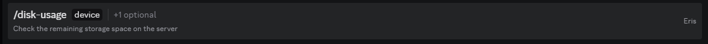

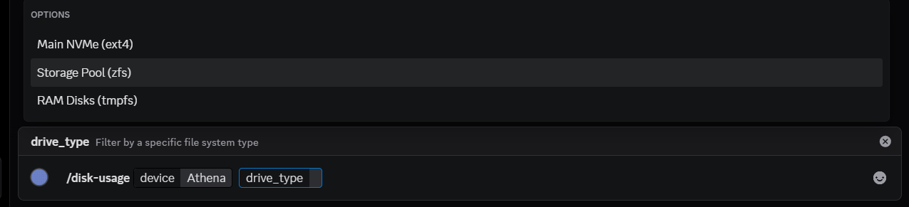

Output will look like this:

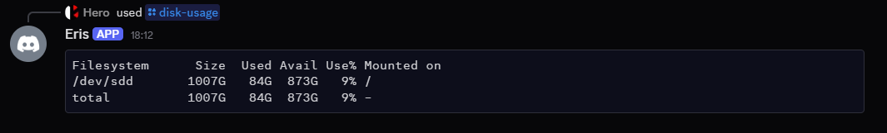

### Output

Now one issue is some command outputs will be too big. My initial idea was to just send it as a text file, and it worked for basic stuff, but it was terrible for tables or order or anything similar, so I decided to send big output as an ✨*image*✨.

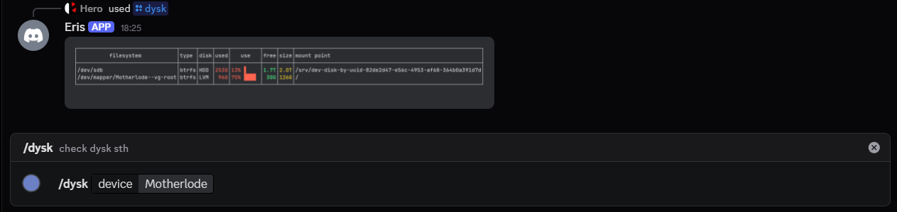

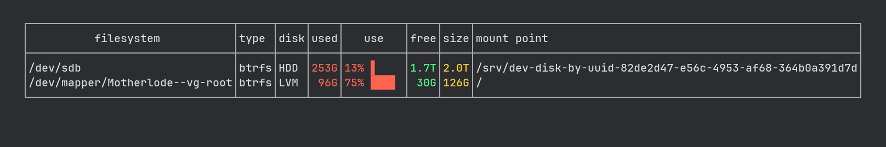

So not only an image, but it supports colors too... worth mentioning this result may not be consistent with all commands, and some commands might require some tweaking. For instance, a command like `fastfetch` will look messy because of the logo, so you could add a fixed flag like `"fixed_flags" : "--logo-position top"`, which will just have the logo above the stats.

### But where?

Good question, this is a segue to `hosts.json`, this is the place where you have your own devices, this is where the commands run.

```json
{  
  "display_name": "discord-cool-name",  
  "name": "the_device_actual_name", 
  "user": "me",  
  "ip": "192.168.1.2",  
  "mac": "A0:B1...", 
  "port": "22",   
  "os" : "linux", 
  "key-path": "/path/to/.ssh/ur_key"  
}
```
- `"name": "the_device_actual_name"`: you will also use this to specify the device in the dashboard (more on that later in dashboard section)
- `"mac": "A0:B1..."`: it's for WOL (Wake On Lan)
- `"port": "22"`: For SSH
- `"os" : "linux"`:This is mainly implemented for Shutdown as commands differ


Now this will appear as a mandatory option for every command (you can see it in the pictures above), and it will end up looking like this. If you do not choose a device, it will result in an error.

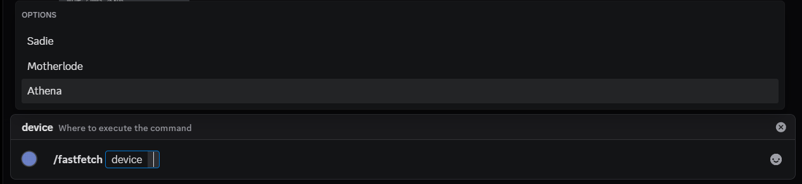

### Architecture

Now onto the technical side of stuff, what happens when the app turns on.

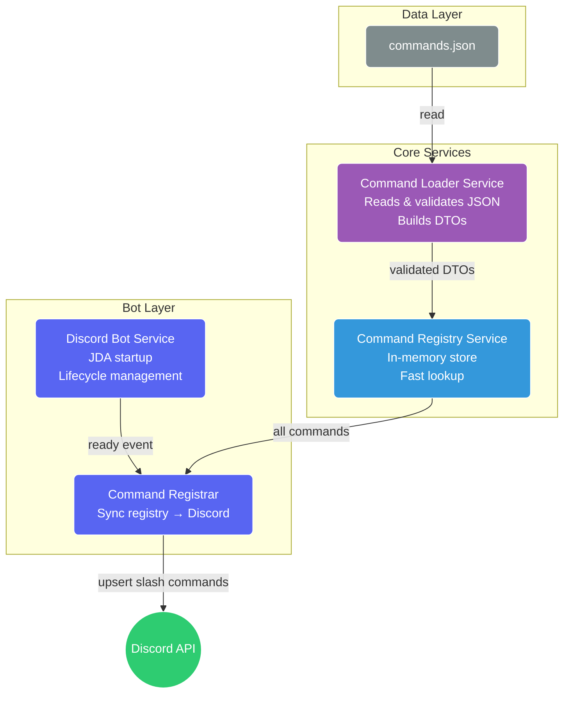

First `CommandRegistryService` calls `CommandLoaderService`, the loader loads the configs into DTOs and the registry stores them in a map. Then the `CommandRegistrar` registers these commands in Discord for them to appear to the user, and voila - you have your commands right at your fingertips.

So what happens when those fingertips of yours press on a command? Let's see.

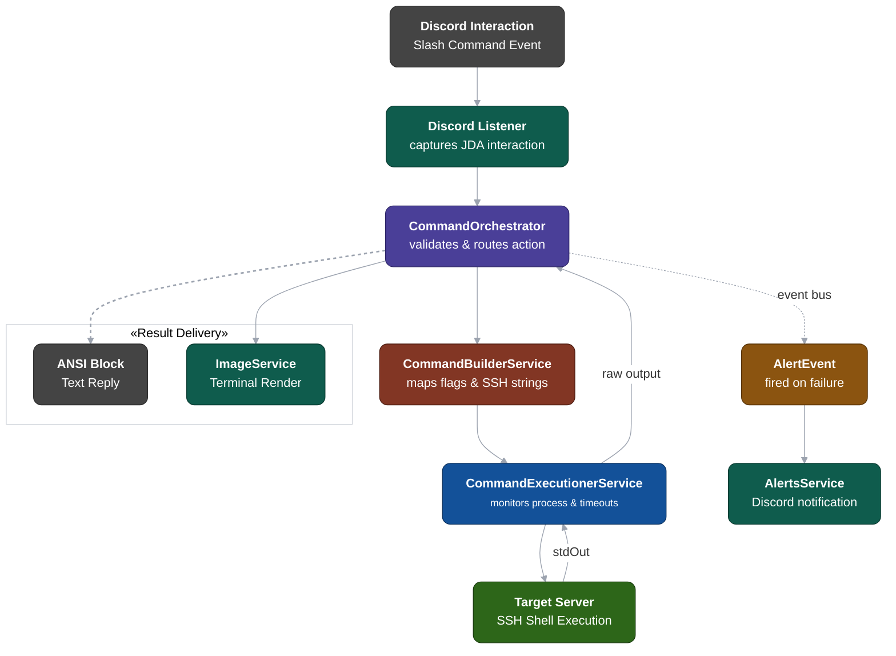
- **Command Orchestrator**: This one pulls the command and the host from `CommandRegistryService` and `HostRegistryService` respectively, calls the builder, takes the `processBuilder` and sends it to Command Executioner for it to be executed there. It also handles if the output should be rendered as an image or not and pretty much anything related to commands.
- **Command Builder**: This one builds the commands by adding the fixed flags and optional flags/arguments and appending it to the host with the key to form one big SSH command that the `ProcessBuilder` can execute.
- **Command Executioner**: This is where the commands are executed. It handles the output and exceptions like interactive shells or commands taking too long.

## Dashboard

Now onto the next big thing. This is the dashboard — or the cooler name that I shall refer to for the rest of the README as — **The Command Centre**.

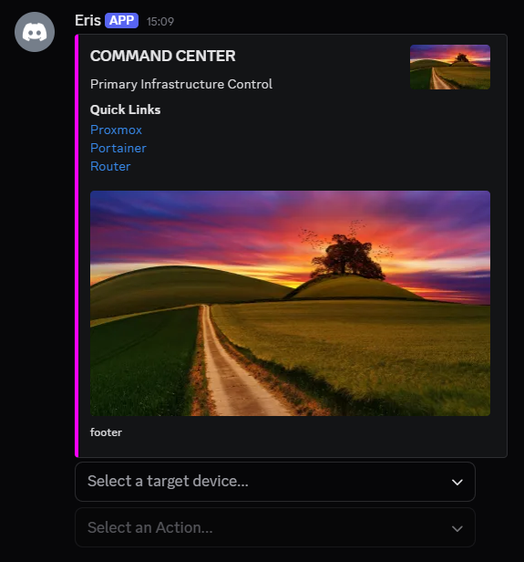

Now the command centre consists of multiple components:

- **Title**: 'COMMAND CENTRE'
- **Description**: 'Primary infra...'
- **Quick Links**: This is where you put your links, self-explanatory.
- **Thumbnail and Image**: Also self-explanatory (thumbnail is the top right one).
- **Target Device**: This is where you want to execute whatever you want.
- **Action**: This is the action you execute on said target device.

You can configure all of that beautiful stuff through `dashboard.json`:

```json
{  
  "ui_settings": {  
    "title": "COMMAND CENTER",  
    "description": "Primary Infrastructure Control",  
    "image_url": "https://images.pexels.com/photos/1146708/pexels-photo-1146708.jpeg",  
    "thumbnail_url" : "https://images.pexels.com/photos/1146708/pexels-photo-1146708.jpeg",  
    "footer": "footer"  
  },  
  
  "quick_links": [  
    { "label": "Proxmox", "url": "http://192.x.x.x:8006"},  
    { "label": "Portainer", "url": "http://192.x.x.x:9000"},  
    { "label": "Router", "url": "http://192.x.x.x"}  
  ],  
  
  "targets": {  
    "import_all_hosts": true,  
    "import_specific_hosts": [  
      "motherlode",  
      "gaming_pc"  
    ]  
  },  
  
  "actions": [  
    {    
      "id": "ping",  
      "label": "📡 Ping",  
      "description": "Pong",  
      "type": "network"  
    },  
    {   
       "id": "wol",  
      "label": "⚡ Wake Up",  
      "description": "WAKE UP SOLDIER",  
      "type": "network"  
    },  
    {      
	  "id": "shutdown",  
      "label": "Shutdown",  
      "description": "Good Night",  
      "type": "system"  
    },  
    {     
	  "id": "restart",  
      "label": "Restart",  
      "description": "Turn the world upside down",  
      "type": "system"  
    }  
  ]
}
```

We talked about `ui_settings` and `quick_links`, and technically we did mention `targets` but let's talk a bit more about it. If you take a look at `targets` you will see `import_all_hosts` and `import_specific_hosts`. As the name suggests, `import_all_hosts` imports all devices in `hosts.json` and `import_specific_hosts` imports specific ones that you specify by their `name` field.

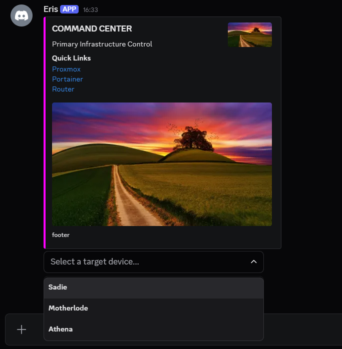

Now for the big architectural part... **Actions**.
First, what are actions? Actions are... well, actions you execute on your devices. Actions can be pretty much anything. Let me give an example:

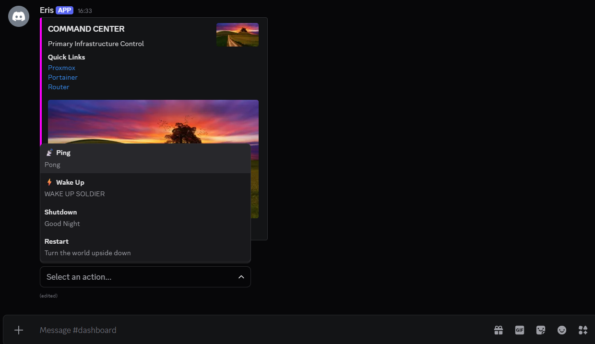

This is what you can do with the current target devices we talked about. There's **Ping**, **Wake Up (WOL)**, **Shutdown**, and **Restart** so far. These are all features. Now, these are basic stuff, but the cool thing is the architecture behind it. Let me explain.

The goal of this project was a command centre - a way to easily control and execute stuff on my devices, mainly servers really. So what if I want to restart a Docker container or create a new Kubernetes pod or update the system? I have to write code for it. I have made it so it is easy to add these features, easy to extend new features instead of hardcoding. This way it's easy to scale and maintain. Let's give an example: the current Wake on LAN uses a local implementation, but you can easily replace it with logic that calls a Smart Home API to handle waking up your devices. So what exactly is the workflow here? How is it implemented?

There are 3 main components: **The Dashboard, The Action Handler, and The Features.**

1. **The Dashboard** is the picture above. It takes whatever features and organizes them into a list of buttons you can click on.
2. **The Action Handler** calls the selected feature and handles the output of that feature - what to show when an action succeeds or fails.
    - These Action handlers are grouped based on type, like **Network** (Ping and WOL) and **System** (Restart and Shutdown).
3. **Features** are basically the buttons you click on to execute something. They can be anything you want.

Another component is the **DashboardRouter**. Since Action Handlers are grouped based on type, the router looks at the feature type selected by the user and calls the appropriate action handler, which is why we define the type in `dashboard.json`.

So how is this maintainable? Well, all you have to do is write an interface called a **Provider**, implement this interface, and just handle the result in the appropriate action handler depending on the type. That's it! This implementation can be anything: an API call, a local in-house implementation of the feature, or whatever you want. The only responsibility is to handle the result/output correctly.

To summarize: you press a button, that button interaction goes to the router, the router looks at the type, calls the appropriate action handler, the action handler calls the feature, the feature returns an answer, and the action handler handles the output and returns the result back up to the AutoDashboard, which sends a message to Discord for the user to see.

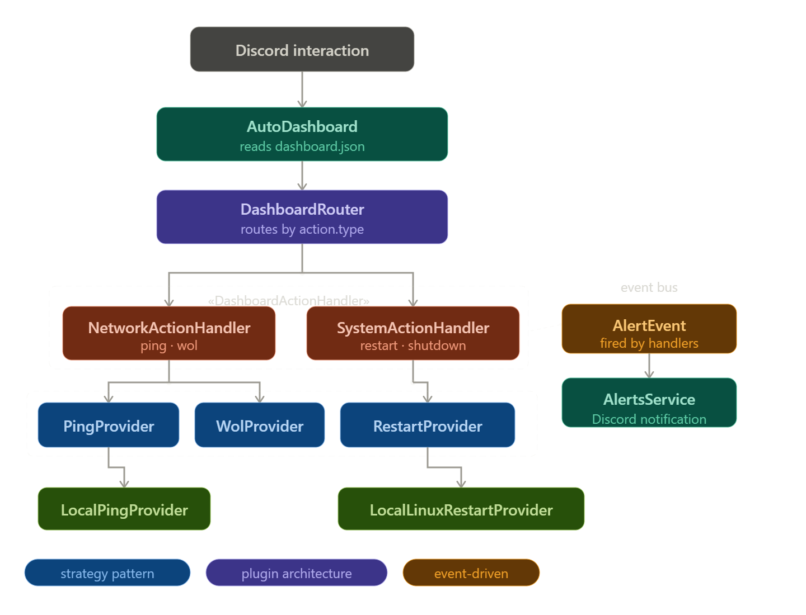

# Conclusion

Now this project will contain many, many improvements and additions as long as I use it personally and still have passion for it, but I think the core is finished and this is a great V1.0. This isn't everything I have talked about; There's how the config files are loaded and how they are automatically created, I shall talk about it in a future README update! So yeah, that is all for now.

# Improvements/Additions

- [x] More Robust Alert/Error handling in Alerts channel
- [ ] Hot-Reloading of configurations
- [ ] Switch from ProcessBuilder to SSHJ for more control
- [ ] Dockerization (Requires a bit of SSH Refactoring)
- [ ] General code quality improvements
- [ ] More Feature Providers (Docker, Proxmox, etc.)
